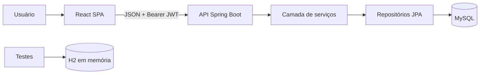

# Arquitetura do Orbis CRM

## Visão geral

O Orbis CRM é uma aplicação web monolítica com frontend SPA e API REST. Em desenvolvimento, React e Spring Boot são executados separadamente. No build de produção, o Vite gera os arquivos do React em `src/main/resources/static`, e o Spring Boot entrega tanto a API quanto a interface.

## Backend

O backend segue uma arquitetura em camadas. Uma solicitação deve seguir o fluxo `controller → service → repository`; o controller não deve conter regra de negócio nem acessar repositórios diretamente.

| Pacote | Responsabilidade | Não deve conter |
| --- | --- | --- |
| `config` | Segurança, JWT, CORS, criptografia e integração SPA | Regras de clientes ou agendamentos |
| `controller` | Rotas HTTP, validação de entrada e códigos de resposta | Consultas diretas ao banco |
| `service` | Regras de negócio, autorização de dono e orquestração | Detalhes de HTTP |
| `repository` | Operações e consultas JPA | Regra de negócio ou validação de tela |
| `model` | Entidades persistidas e enums do domínio | Acesso a serviços ou repositórios |
| `dto` | Contratos da API que não são entidades | Lógica de persistência |
| `exception` | Exceções de domínio e tratamento HTTP padronizado | Tratamento duplicado nos controllers |

### Segurança e isolamento de dados

1. O login valida e-mail e senha com BCrypt.
2. O backend gera um JWT assinado com `JWT_SECRET`.
3. O frontend o envia no cabeçalho `Authorization`.
4. `JwtFilter` valida o token e coloca o usuário autenticado no `SecurityContext`.
5. Os serviços obtêm o usuário atual com `UsuarioAutenticadoService` e restringem clientes e agendamentos ao proprietário.

Novos recursos que pertençam a um usuário devem seguir o mesmo padrão: a entidade possui um proprietário, o serviço o define na criação e valida a propriedade antes de buscar, alterar ou excluir por ID.

## Frontend

O frontend mantém uma separação leve e adequada ao tamanho atual:

| Diretório | Responsabilidade |
| --- | --- |
| `pages` | Telas ligadas às rotas e seus estados locais |
| `components/ui` | Componentes visuais genéricos e reutilizáveis |
| `lib/api.ts` | Cliente HTTP, token, tipos e chamadas da API |
| `lib/utils.ts` | Utilitários sem regra de domínio |

Ao adicionar uma área maior, como agenda ou dashboard, crie uma página em `pages` e mantenha chamadas HTTP relacionadas em `lib/api.ts`. Se o domínio crescer, a evolução recomendada é criar `features/<domínio>/` para reunir página, componentes e tipos específicos, preservando `components/ui` apenas para elementos genéricos.

## Convenções de evolução

- Novos endpoints devem usar o prefixo `/api` e exigir autenticação, exceto cadastro e login.
- Entrada e saída públicas devem preferir DTOs em vez de expor entidades quando houver risco de vazar campos ou quando o contrato precisar evoluir.
- Validações de formato ficam no DTO/entidade; regras que dependem do estado do sistema ficam no serviço.
- Listagens que podem crescer devem ser paginadas no backend; clientes seguem o contrato `PaginaResponse` e aceitam busca e filtro por etapa.
- Antes de criar permissões por papel, mantenha a validação de proprietário nos serviços. Papéis devem complementar, e não substituir, esse isolamento.
- Não coloque segredos em arquivos versionados. Use `.env` local e variáveis de ambiente no deploy.
- Arquivos gerados (`target`, `node_modules` e configurações da IDE) permanecem ignorados pelo Git.
- Antes de modificar rotas ou contratos, atualize o README e esta documentação quando a mudança afetar a arquitetura.
